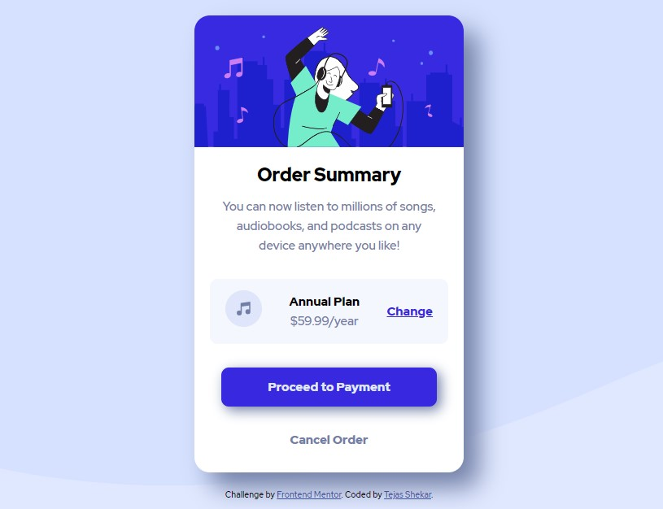

# Frontend Mentor - Order summary card solution

This is a solution to the [Order summary card challenge on Frontend Mentor](https://www.frontendmentor.io/challenges/order-summary-component-QlPmajDUj). Frontend Mentor challenges help you improve your coding skills by building realistic projects.

## Table of contents

- [Overview](#overview)
  - [The challenge](#the-challenge)
  - [Screenshot](#screenshot)
  - [Links](#links)
- [My process](#my-process)
  - [Built with](#built-with)
  - [What I learned](#what-i-learned)
  - [Continued development](#continued-development)
- [Author](#author)

## Overview

### The challenge

Users should be able to:

- See hover states for interactive elements

### Screenshot



### Links

- Solution URL: [Click here](https://www.frontendmentor.io/solutions/built-using-purely-html-and-css-wWeGuw0F1)
- Live Site URL: [Click here](https://tejasshekar.github.io/Frontend-mentor--order-summary-component/)

## My process

### Built with

- Semantic HTML5 markup
- CSS custom properties
- Flexbox
- Mobile-first workflow

### What I learned

1. How to use display:flex and how I can save time using it.
2. How to add active states for buttons.
3. How to disable text selection and also remove blue box on tap

```css
button {
  user-select: none;
  -webkit-tap-highlight-color: transparent;
}
```

### Continued development

1. I still need to understand and practise more on what properties work on certain elements and what properties does not work. Also, I will be working on methods where I can avoid repetitive use of same properties over and over.
2. I need to understand how to use flexbox and also manipulate items inside each child of flexbox like dividing flexbox on custom proportions.

## Author

- Frontend Mentor - [@TejasShekar](https://www.frontendmentor.io/profile/TejasShekar)
- Twitter - [@tejas_shekar](https://twitter.com/tejas_shekar)
